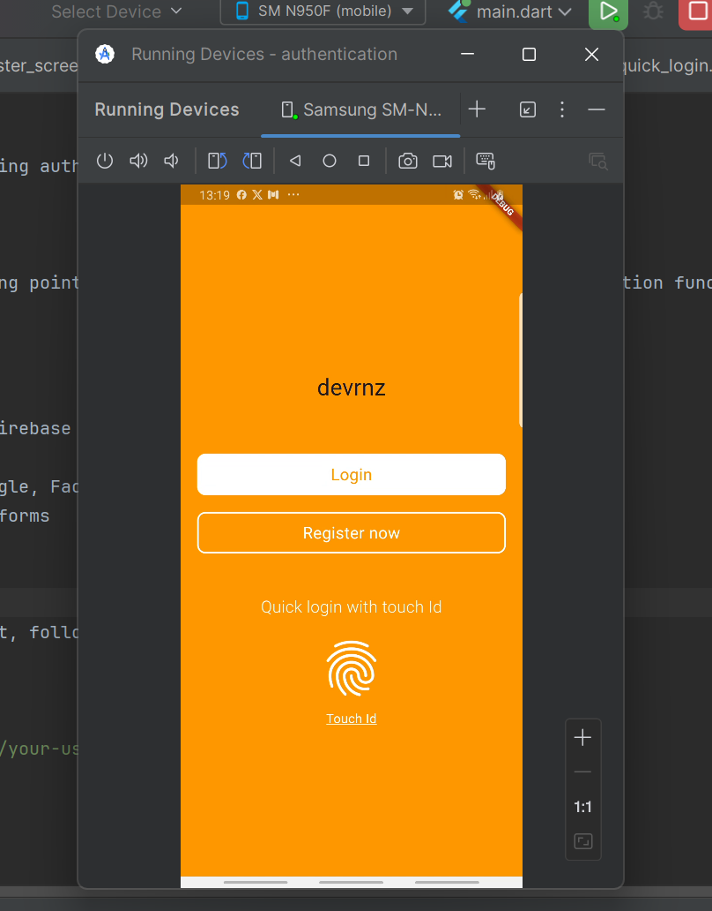
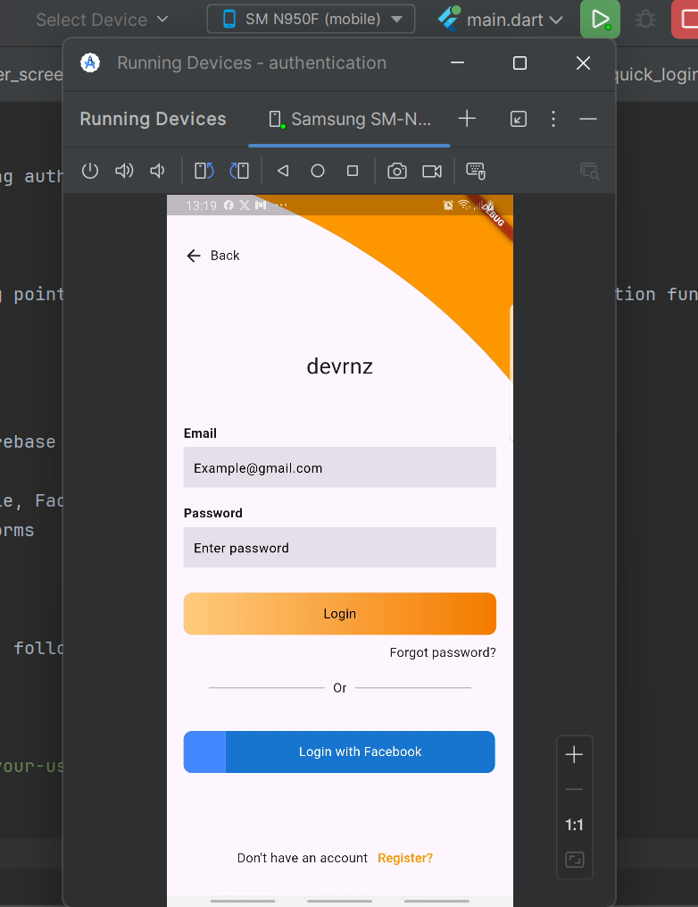
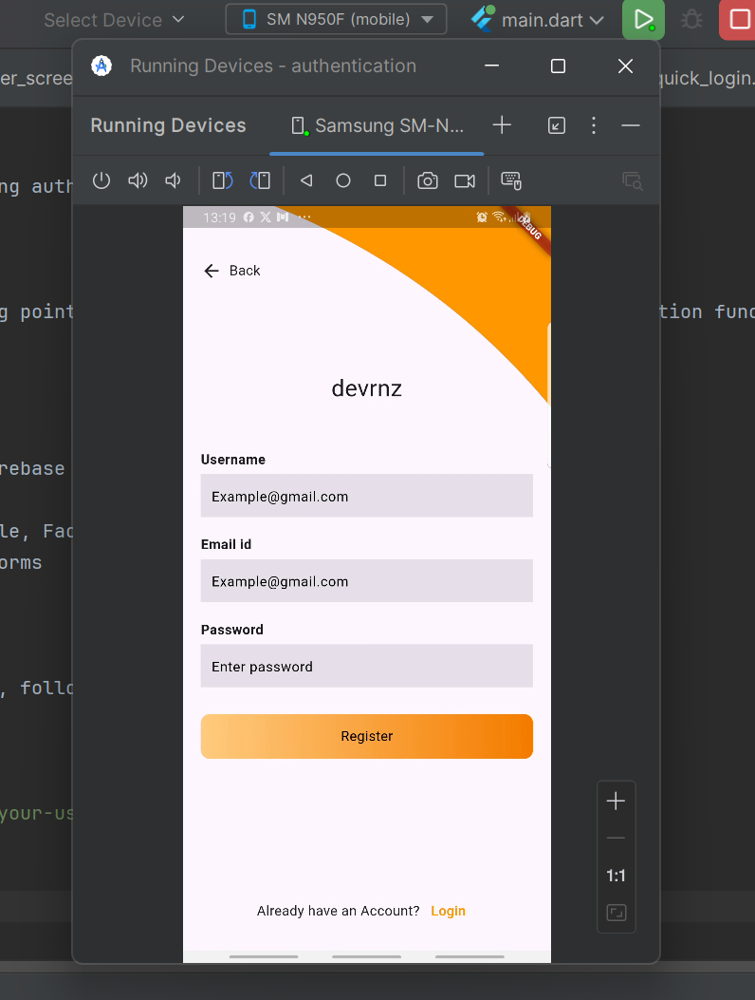

# Authentication

A Flutter project for implementing authentication features.

## Overview

This project serves as a starting point for building a Flutter application with authentication functionality. It includes the basic setup and structure to help you get started quickly.

## Features


- User login and registration
- Secure authentication using Firebase or custom backend
- Password reset functionality
- Social login integration (Google, Facebook, etc.)
- Responsive UI for mobile platforms

## Getting Started

To get started with this project, follow these steps:

1. Clone the repository:
   ```bash
   git clone https://github.com/your-username/authentication.git
   cd authentication

2. install dependencies
    flutter pub get

3. Run the application
    flutter run
    
Project Structure
lib/
├── main.dart          # Entry point of the application
├── screens/           # UI screens (e.g., Login, Signup)
├── services/          # Authentication and API services
├── widgets/           # Reusable UI components
└── utils/             # Utility functions and constants

Screenshots

|  |   |   |
|------------|---|---|

